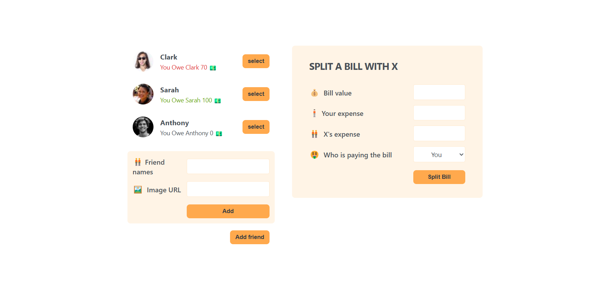
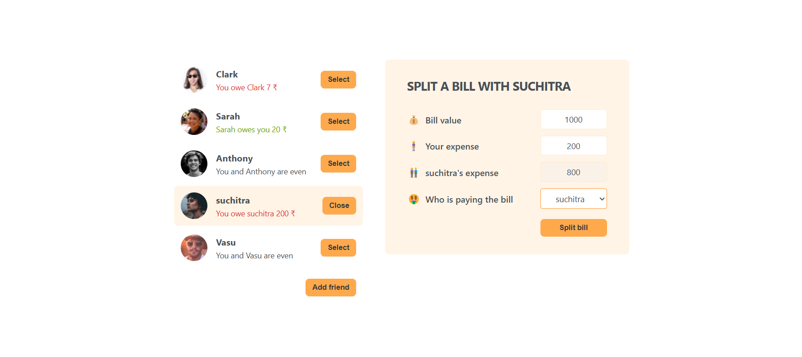

# Split Bill App

A React-based application for managing shared expenses among friends. This app allows you to add friends, track balances, and split bills effortlessly. It provides a user-friendly interface to manage expenses and keep track of who owes whom.

---

## 🚀 Features

- **Add Friends:** Add friends with their name and profile picture.
- **Track Balances:** Keep track of who owes you or who you owe money.
- **Split Bills:** Easily split bills with selected friends.
- **Interactive UI:** Select friends, add bills, and update balances dynamically.

---

## 🛠️ Built With

- **React:** For building the user interface.
- **useState Hook:** For state management.
- **CSS:** For styling the application.

---

## 📸 Screenshots

### Friend List



### Add Friend Form


### Friend List


### Split Bill Form



---

## 📂 Folder Structure

```
project-root/
├── src/
│   ├── App.js           # Main app component
│   ├── index.js         # Entry point
│   ├── components/      # Additional components (if any)
│   └── styles.css       # Styling
├── public/
│   └── index.html       # HTML template
├── assets/              # Screenshots and images
│   ├── friend-list.png
│   ├── add-friend-form.png
│   └── split-bill-form.png
└── README.md            # Project documentation
```

---

## 🧑‍💻 How to Run the Project

1. **Clone the repository:**

   ```bash
   git clone https://github.com/your-username/split-bill-app.git
   ```

2. **Navigate to the project directory:**

   ```bash
   cd split-bill-app
   ```

3. **Install dependencies:**

   ```bash
   npm install
   ```

4. **Start the development server:**

   ```bash
   npm start
   ```

5. Open your browser and go to `http://localhost:3000` to view the app.

---

## 🌟 Acknowledgments

- Profile pictures generated using [Pravatar](https://pravatar.cc/).
- Inspired by the need for a simple expense-sharing tool.
